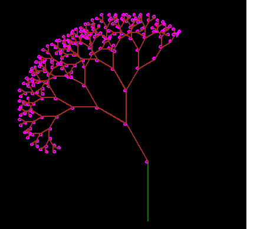
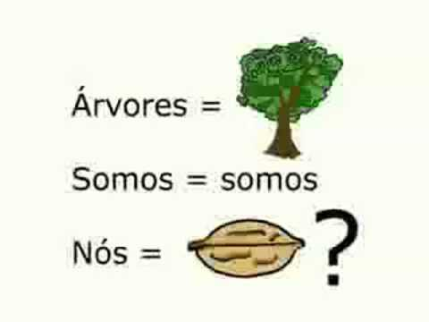

# Computação Gráfica - Árvore 🌳

<f2 align = "left"> **O seguinte projeto possui o objetivo de construir uma árvore por meio de conhecimentos com fractal e nós.**</f2> 
 

 

Para utilizar um módulo no Python, utilizamos o comando import (importar) seguido do nome do módulo que queremos importar. Após a importação, já podemos utilizar todos os objetos e funções que o módulo disponibiliza.
   
  
    import turtle
    

Primeiro, defina a cor de fundo, nesse caso, para preto:
   
  
    turtle.bgcolor("black")
  

 Em seguida, crie um novo objeto turtle chamado, defina o tamanho da caneta, a cor da tartaruga, vire-a 90 graus para a esquerda, mova-a para trás em 100 unidades e defina a sua velocidade: 

    arv = turtle.Turtle()
    arv.pensize(2)
    arv.color("green")
    arv.left(90)
    arv.backward(100)
    arv.speed(200)

 Defina uma função que recebe um argumento i e realize validações de entrada e saída, considerando cores e o raio dos nós 

  
    def drawTree(i):
    if i < 10:
        print("Entrouuu")
        return
    else:
        print("Saiuuu")
        arv.forward(i)
        arv.color("magenta")
        arv.circle(2)
        arv.color("brown")
        arv.left(30)
        drawTree(3*i/4)
        arv.right(60)
        drawTree(3*i/4)
        arv.left(30)
        arv.backward(i))

 Por fim, chame a função e espere o usuário fechar a janela do turtle:

    drawTree(100)
    turtle.done()
